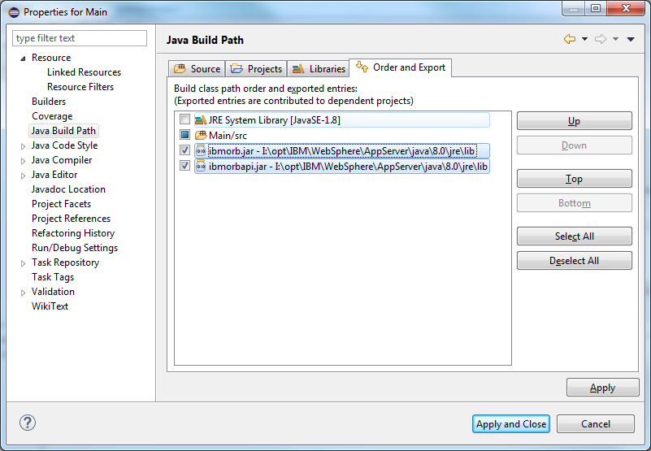

# IBM Corba Impl Outside WebSphere Container

Short time ago, I needed to reproduce a problem that we detected while running our applicaiton on WebSphere. The problem was located in the Corba serialization/deserialization process within the IBM JVM.
It was difficult to reproduce the problem because we depended on WebSphere to do so. With the help of IBM support, we have been able to narrow down the problem to the point where we could reproduce it by running a simple java application.
   
I leave here the implementation sd used, if it will be useful to someone, someday.

# Add the IBM Corba libs as presented:

 